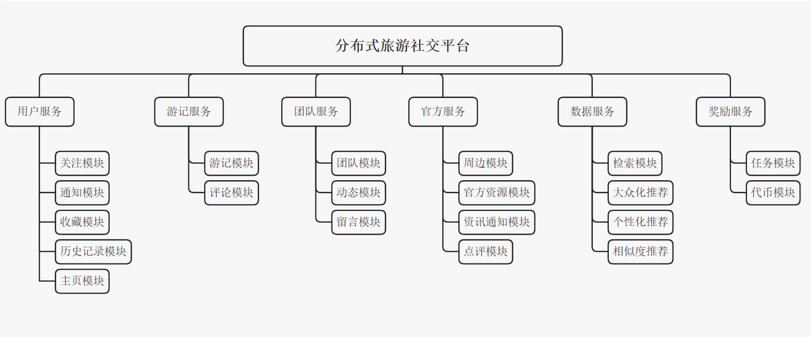
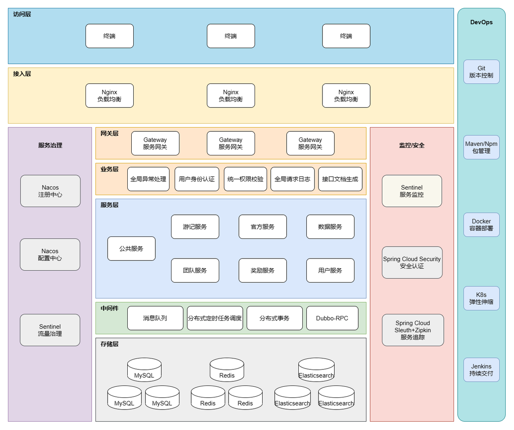

# Travel

## 项目介绍

旨在通过完善的社交功能+奖励机制，带动用户在平台上分享旅游攻略、旅行记录。另外，让旅游地作为官方用户的身份加入到平台中，在平台中建设旅游网站，发布官方讯息，游客无需漫步，让游客与官方能够紧密联系。

## 项目结构

## 项目架构

## 技术选型

- 前端：
  - 框架：Vue 3
  - 前端构建工具：Vite
  - 状态管理库：Pinia
  - 组件库：Ant Design Vue 
  - 包管理器：Yarn/Npm
  - 部署：Nginx （高性能的 HTTP 和 反向代理 web服务器）
- 后端
  - 框架：Spring Boot、Spring Cloud、Spring Cloud Alibaba
  - todo：安全框架：SpringSecurity（认证，授权）
  - 数据库：MySQL
  - 缓存：Redis
  - 检索引擎：ElasticSearch
  - 消息队列：RabbitMQ
  - 部署：Docker
  - 推荐算法（协同过滤算法(UserCF, ItemCF)、基于内容的推荐算法、混合推荐算法）
  - todo：分布式事件流平台：Kafka
  - todo：分布式计算框架：Spark（流式处理：SparkStreaming，核心：SparkCore）

## 前端仓库
[https://github.com/nebulaHZH/Travel](https://github.com/nebulaHZH/Travel)